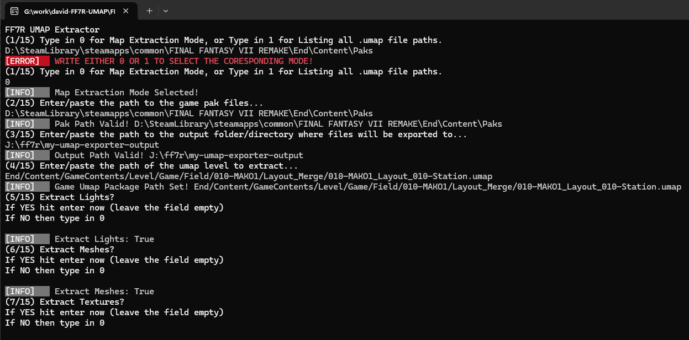
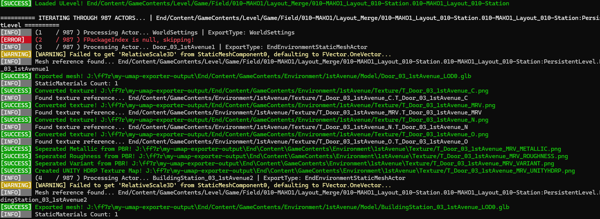
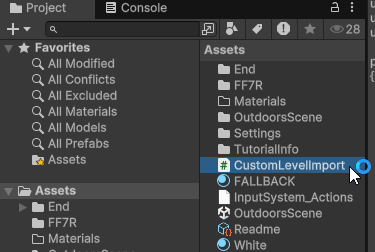
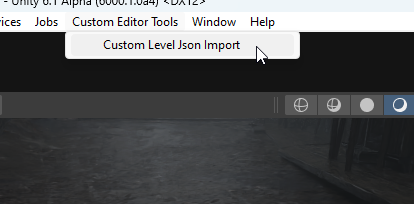
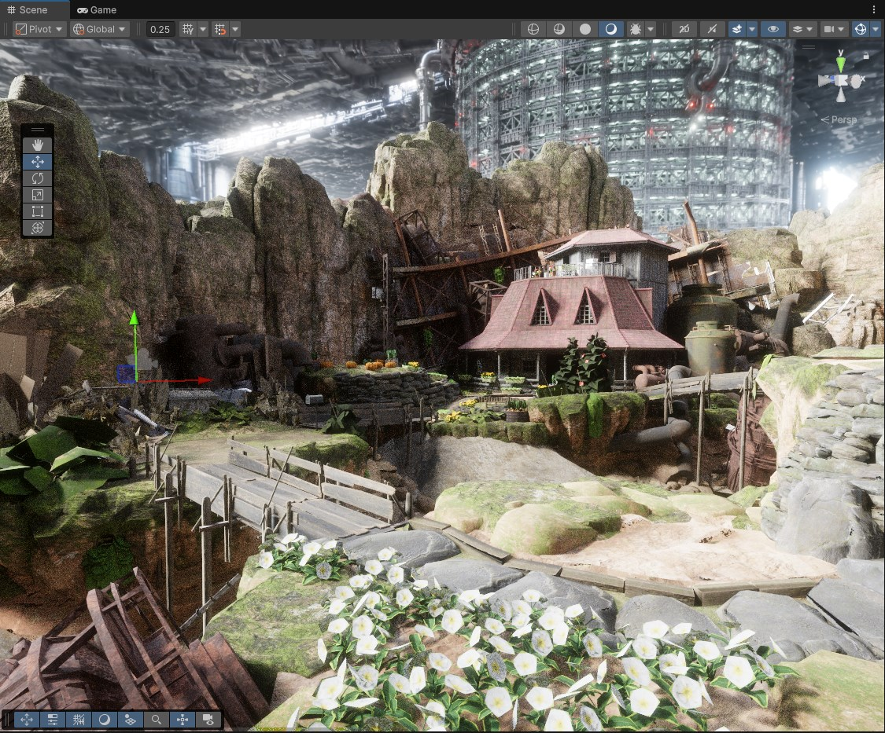
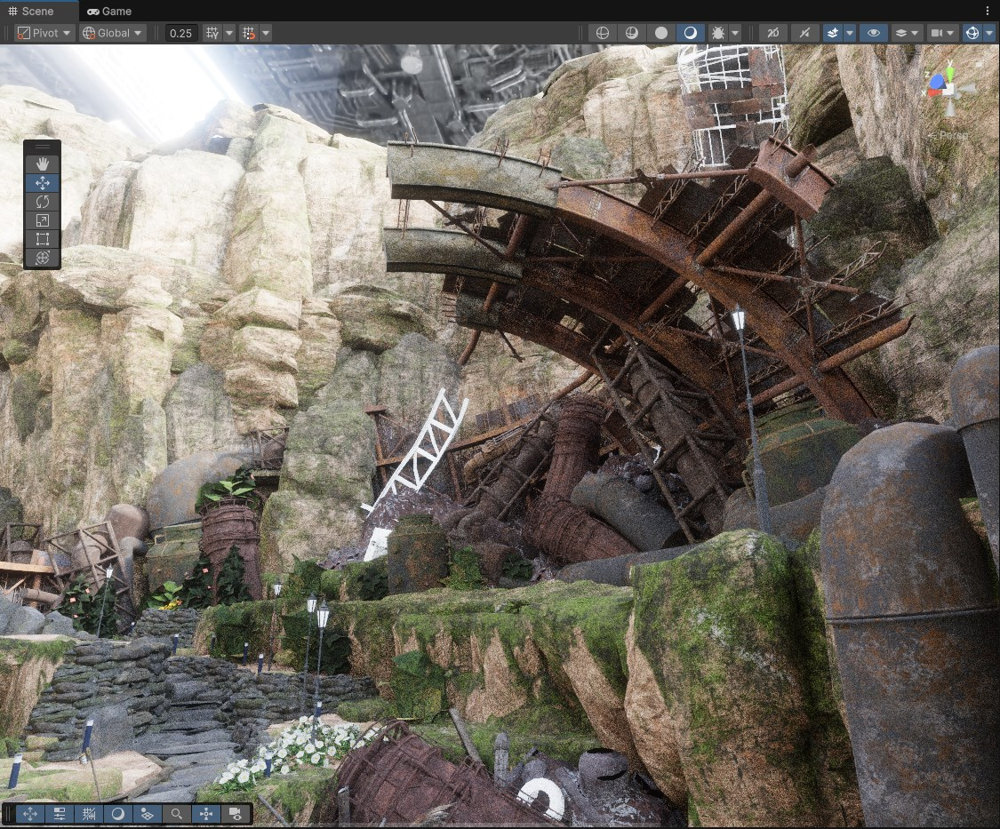
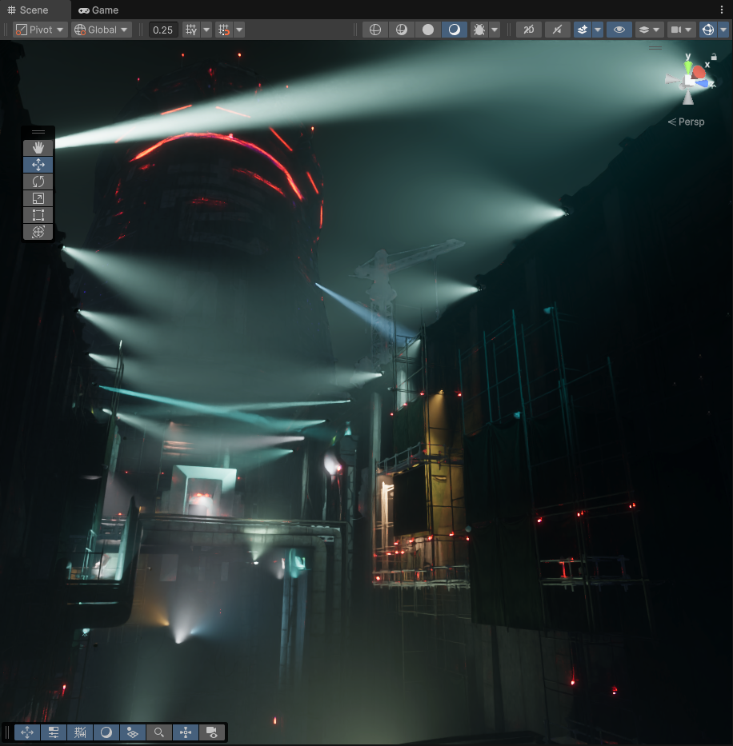
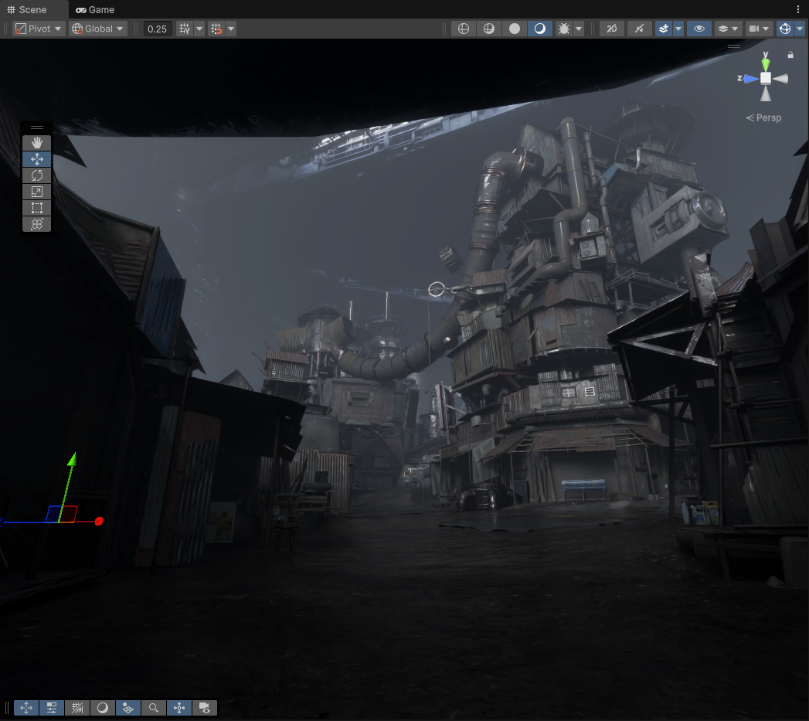

# FF7R .umap Extractor
This is a ***work-in-progress*** map *(.umap)* extractor for [Final Fantasy 7 Remake Intergade PC](https://store.steampowered.com/app/1462040/FINAL_FANTASY_VII_REMAKE_INTERGRADE/) version that is standalone *(mostly for the time being)*.

This is a heavily modified version of [MinshuG's BlenderUmap2 Blender Addon](https://github.com/MinshuG/BlenderUmap2) *(which is also a derivative of [Amrsatrio's BlenderUmap2](https://github.com/Amrsatrio/BlenderUmap2))* that is specific to [Final Fantasy 7 Remake Intergade PC](https://store.steampowered.com/app/1462040/FINAL_FANTASY_VII_REMAKE_INTERGRADE/). In it's finished form it's intended to be fully standalone *(meaning only one application)*, however for the time being the map post-extraction assembly is being handled with a Unity Editor script that builds a Unity scene from the extracted .umap file and the assets referenced within it.

Currently it extracts all textures/materials/models/lights from a map, and writes a coresponding .json file that holds the paths/references to the extracted textures/models.

## Part 1 - Map Extraction (Console App)

The first part to the app is parsing the given *.umap* file path, and iterating through it's data structures to get the textures/materials/models/lights from the map. 

This is a lengthy process as it has to search through each actor in a level, and get all of the necessary data and extract and convert the required assets.

Once the map extraction is complete, a .json text file will be generated. This is an intermediate document that holds references to the actors in the scene, as well as the meshes/materials/textures used along with any light actors.

## Part 2 - Map Assembly (Unity Project)

***NOTE: In the future this will be handled in the console app for simplicity. The map will be extracted and then assembled into an internal scene file using [Assimp.NET](https://github.com/StirlingLabs/Assimp.Net) library and exported into an fbx or gltf / glb that you can open in Blender or any other 3D software/game engine package. For prototyping the inital early version of this map extractor I am using [Unity](https://unity.com/).***

The second part to the app is re-assembling the map based on what we extracted using that .json file as the base. Create a blank unity project and ***[drag the editor script here](https://github.com/frostbone25/FF7R-UMAP/blob/main/UnityEditorScript/CustomLevelImport.cs)*** into your Unity Assets folder for your created project.

## Screenshots

## Issues / Bugs

If there are any issues please report them [on github here on the repository](https://github.com/frostbone25/FF7R-UMAP/issues).

### Credits / Sources

- [MinshuG's BlenderUmap2 Blender Addon](https://github.com/MinshuG/BlenderUmap2)
- [Amrsatrio's BlenderUmap2](https://github.com/Amrsatrio/BlenderUmap2)
- [CUE4Parse C# Library](https://github.com/FabianFG/CUE4Parse)
- [UE4-DDS-Tools](https://github.com/matyalatte/UE4-DDS-Tools) *(included in dependencies because CUE4Parse Conversion library can't convert FF7R textures)*